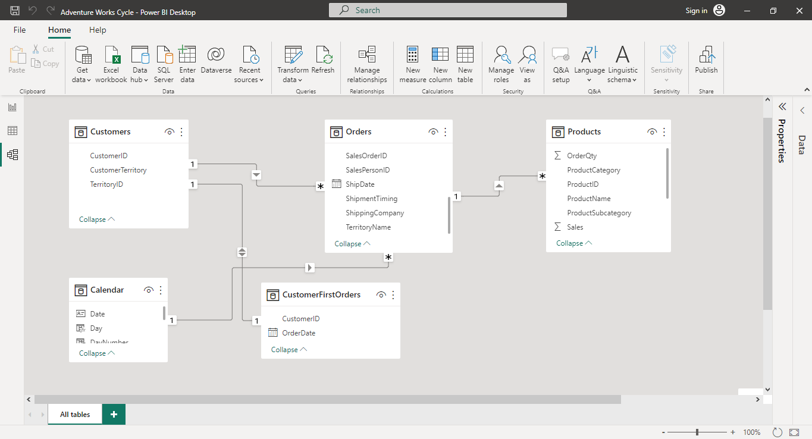
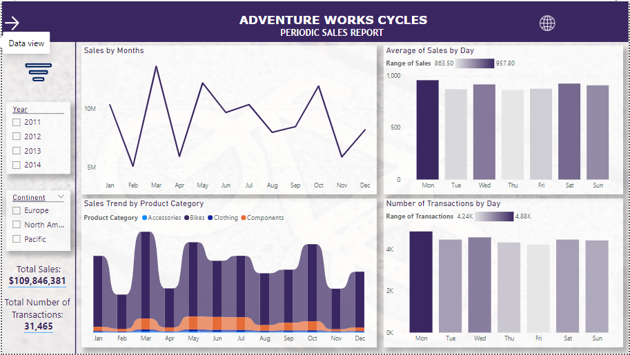
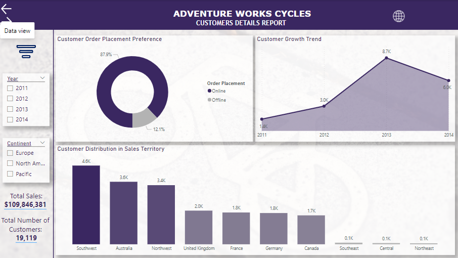
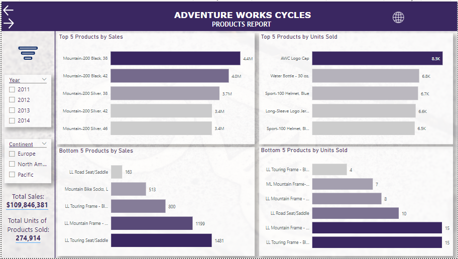

# Adventure Works Cycles Sales Report

## Introduction
This is a SQL & Power BI project on Adventure Works 2019 sample database, which is a fictional company’s database created by Microsoft for educational and testing purposes. The goal of the project is to identify products which generated the highest and lowest sales, observe the popularity of products, and identify customer trends and preferences.
## Problem statement
To use the business database to identify:
- Which product generated the most sales and which generated the least.
- Which product was the most popular and which was the least popular.
- Customers most preferred means of placing orders.
- Which continent and territory generated the most sales.
## Skills demonstrated
The following SQL Server Management Studio skills were incorporated:
- Importing a database.
- Generating a database diagram.
- Data wrangling with SQL.

The following Power BI skills were also incorporated into this report:
- DAX – I created DAX columns to use as a primary date column, then extracted columns including Date, Day, Day Number, Month Number, Quarter, Year and Month columns.
- Modelling – Three tables were loaded into Power BI (1 dimension table and 2 facts table) while the Calendar and ‘CustomerFirstOrders’ Tables were generated using the New Table, Power Query and DAX functions. The data was modelled with appropriate primary key and foreign key relationships.
- Filters – I used the Filter pane to filter out Top and Bottom Products subcategories by sales to give insight to the best and worst performing products.
- Slicers – I used Slicers to create a more dynamic report that filters result through years and order continents.
- Bookmarks – I used Bookmarks to manage views on the report.
- Tooltips – I created dynamic tooltips to help interpret the visuals better.
- Quick measure – I used Quick measure to create custom calculations faster.
- Page navigation & Buttons – I used buttons to aid page navigation and improve user interactivity.
- Forecast – I used Forecast to predict sales trend and patterns for the following year.
- Drill through – I created a drill through page to help users gain deeper insight and have a better understanding of the underlying data.

## Data sourcing
The Adventure Works 2019 database was used for this project. This fictional company’s database was created by Microsoft and can be downloaded [here](https://github.com/Microsoft/sql-server-samples/releases/download/adventureworks/AdventureWorks2019.bak).

## Data transformation
The database was imported into SQL Server Management Studio and then queried to obtain the needed data from the schemas and tables. The following schemas and Tables were queried: 
Sales.SalesOrderheader, Sales.SalesOrderDetail, Sales.Customer, Sales.SalesTerritory, Purchasing.ShipMethod, Production.Product, Production.ProductCategory, and Production.ProductSubcategory.

Here's the link to my SQL [query](https://github.com/emmywritescode/SQL-Queries/blob/main/Adventure%20Works%20Cycles%202019.sql).

## Modelling
The model is a star schema. Overall, there are three (3) dimensions tables and two (2) facts table. Two tables created named ‘Calendar’ and ‘CustomerFirstOrders’ tables were generated using New Table, Power Query and DAX functions. The Orders table (fact table) was joined to the Products table (fact table) in a one-to-many relationship. The Calendar table was also joined to the Orders table in a one-to-many relationship while the Customers table was joined to the CustomersFirstOrders table in a one-to-one relationship and to the orders table in a one-to-many relationship.

## Analysis and Visualizations
The report comprises 6 pages
1. Periodic Sales Report
2. Revenue/Sales Trend and Forecast
3. Customer Details Report
4. Products Category and Subcategory Report
5. Products Report
6. Insights

You can interact with the full report [here](https://app.powerbi.com/view?r=eyJrIjoiMGRmYTYyMDUtMmY5OS00NDQzLWJiOTQtMGYzYWM4NDgxMTM1IiwidCI6ImQ4NzlkOWE0LTZmODEtNDU4NS1iYWJjLWM4OGZjMzBmZTc3YiJ9).

**Features:**
- The Filter icon removes current filters applied to the report.
- The Direction arrow navigates to the next page.
- The Web icon shows hidden links to my social handles.

### Periodic Sales Report:

- The company generated over $109M in sales over the entire period with most sales coming from 2013 fiscal year.
- Daily sales averaged between around $900 each day of the week and more than 31K total transactions were made.

### Customer Details Report:

- More than 19K customers made purchase from the company.
- Customers placed more orders online than offline.
- Most customers are from Southwest territory.
- Customers increased over the years but mostly in 2013.

### Products Category and Subcategory Report:

- Products in the Bikes category generated the most sales totalling $95M while Accessories generated the least sales at just $1M.
- In most territories, the most popular products were from the Bikes category.
- Products in the Road Bikes subcategory generated the most sales at $44M while Chains generated the least at just $9K.

### Products Report:

- _Mountain-200 Black, 38_ generated the highest sales at $4.4M while _LL Road Seat/Saddle_ had the least sales at only $163.
- The most popular product was _AWC Logo Cap_ which sold 8.3K units while the least popular was _LL Touring Frame-Blue, 58_ which sold only 4 units.

## Conclusion
- North America generated the highest amount in overall sales at $79.4M which is more than the other two continents combined.
- The company sold 266 different products throughout the period.

## Recommendations
Further analysis should be carried out to figure out how the worst performing products can be made to generate sales or discontinued. A deeper dive into the customers data could also reveal if they would appreciate being upsold on some of the company's worst performing products.

